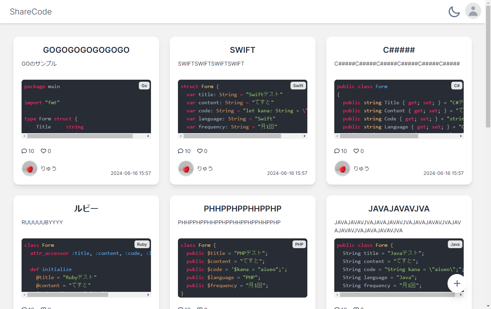
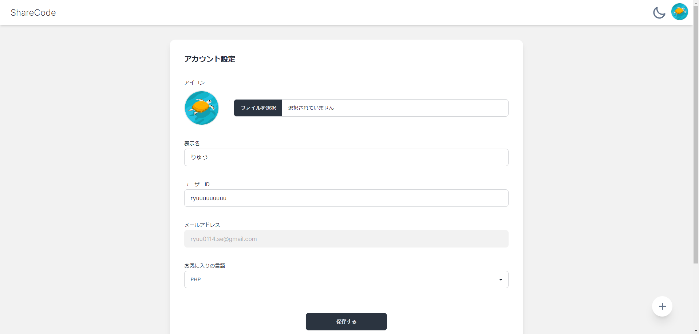

(制作途中です)

# 🚀 ShareCode

ShareCodeは、「手軽に、瞬時に、世界中へ。ちょっとしたコードをすぐに共有できるサービス」です。以下にその主な機能と画面のスクリーンショットを紹介します。

## 🏠 ホーム

ホーム画面では、「公開」で投稿された様々な投稿が一覧化されています。

## 📄 投稿詳細

投稿詳細画面では、投稿の詳細を閲覧することができ、コメントやいいねを残すことができます。

## 🌓 ダークモード

右上の太陽/月アイコンからダークモードを切り替えることができます。

## 🔑 ログイン

右上のアイコンからログインを選択することで、OAuth認証を使用したログインを行うことができます。(Google/Github)

## 📝 投稿

投稿画面では、自分が共有したいコードを投稿することができます。
必要項目を入力後、プログラミング言語 / 公開状態を選択してください。

## ⚙️　設定

設定画面では、プロフィールの設定を行うことが出来ます。
お気に入りの言語を選択すると、投稿する際に自動的にその言語が選択されます。

## 使用した技術スタック
- フロントエンド
 　- React
 　- TypeScript
 　- TailwindCss
 　- DaisyUI
- バックエンド
　 - Laravel
　 - Inertia.js
 　- MySQL
